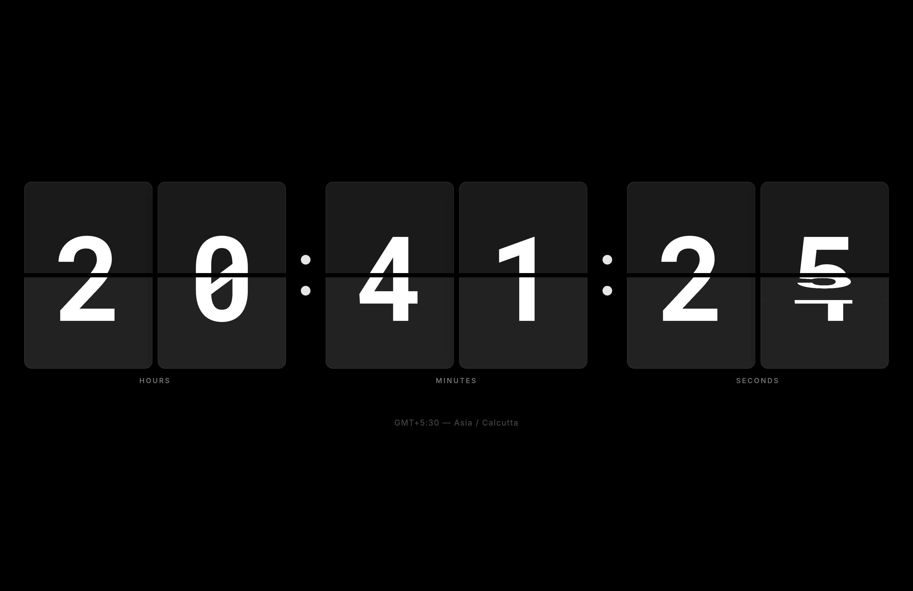

# ⏰ Flip Clock

A stunning and minimal full screen flip clock desktop application for macOS built with Electron. It provides a clean and realistic animated time display that covers your entire screen.



## ✨ Features

- **Full-screen frameless window** — no browser chrome, no distractions
- **Realistic flip animation** — top half flips down over the bottom, like a real mechanical flip clock
- **Pure black & white design** — flat cards, no gradients, clean aesthetic
- **Dark / Light mode** — toggle between black and white themes
- **System time sync** — uses your Mac's internal clock (NTP-synced by macOS)
- **Timezone picker** — searchable dropdown with 400+ IANA timezones
- **12H / 24H format** — switch between time formats
- **Show/Hide seconds** — toggle seconds display (separator hides too)
- **Show/Hide date** — toggle the date display
- **Settings persistence** — all preferences saved automatically
- **Double-click launcher** — includes a `FlipClock.app` bundle for quick launch

## 🚀 Getting Started

### Prerequisites

- [Node.js](https://nodejs.org/) (v18 or later)
- npm (comes with Node.js)

### Installation

```bash
git clone https://github.com/Ramneet-Singh1/Flip-Clock.git
cd Flip-Clock
npm install
```

### Run

```bash
npm start
```

Or simply **double-click `FlipClock.app`** in the project folder (macOS only).

> **Tip:** Drag `FlipClock.app` to your Dock for instant access!

## ⌨️ Keyboard Shortcuts

| Shortcut | Action |
|----------|--------|
| `S` | Open Settings |
| `Esc` | Close Settings |
| `⌘F` | Toggle Fullscreen |
| `⌘Q` | Quit |

## ⚙️ Settings

Hover the top-right corner to reveal the settings gear icon. You can configure:

- **Time Format** — 12H or 24H
- **Show Seconds** — ON/OFF
- **Show Date** — ON/OFF
- **Timezone** — search from 400+ IANA timezones
- **Dark Mode** — toggle between dark and light themes

## 🛠️ Tech Stack

- **[Electron](https://www.electronjs.org/)** — native desktop app shell
- **HTML/CSS/JS** — pure vanilla, no frameworks
- **[Intl API](https://developer.mozilla.org/en-US/docs/Web/JavaScript/Reference/Global_Objects/Intl)** — timezone handling
- **CSS 3D Transforms** — flip card animations

## 📁 Project Structure

```
Flip-Clock/
├── main.js              # Electron main process
├── index.html           # Clock UI structure
├── styles.css           # Pure B&W theme & animations
├── clock.js             # Clock logic & settings
├── package.json         # Project config
├── FlipClock.app/       # macOS app launcher
├── screenshot.png       # App screenshot
└── .gitignore
```

## 📄 License

MIT
